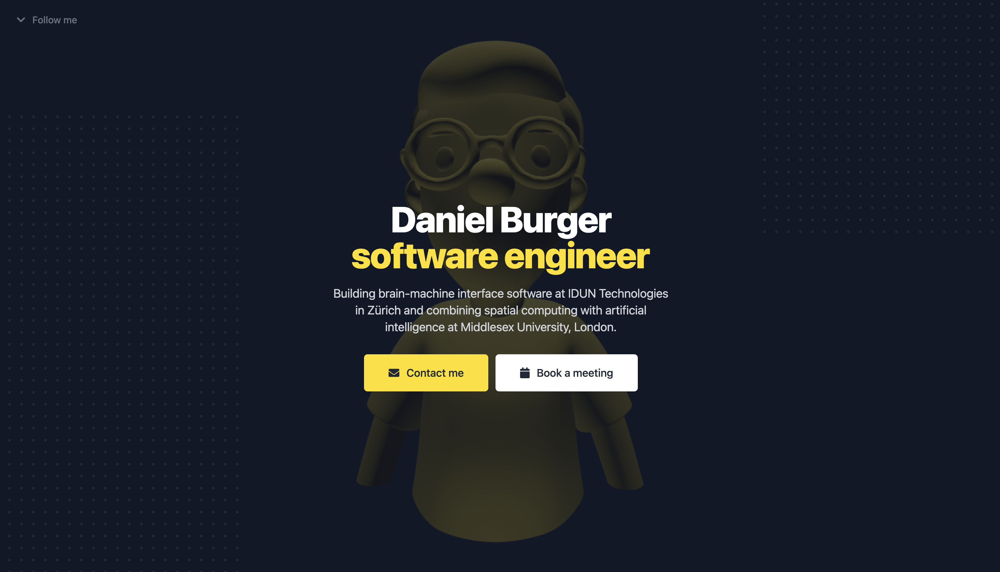

# Personal Website

Complete source code of my personal website utilising the alpha version of Blitz.js to try out the zero-API data layer abstraction while also adding 3D elements via R3F to give it a custom touch.

> More information coming soon.

## Prerequisites

- [Node.js](https://nodejs.org): `v16.10.0`
- [Yarn](https://yarnpkg.com): `v1.22.11`
- [Git](https://git-scm.com): `v2.22.0`

## Guides

### Run the build Docker image

- Build the Docker image with `docker build . -t personal-website:latest`.
- Run the created image with `docker run -p 8080:8080 personal-website`.
- Access the site on <http://localhost:8080>.

### Run the dev server

- Install all dependencies with `yarn`.
- Start the hot-reload Blitz development server with `yarn dev`.
- Access the site on <http://localhost:3000>.
